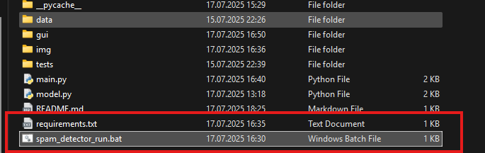

# Spam Detector (Python + PyQt6)

Aplikacja z graficznym interfejsem. Model uczy się na danych, samodzielnie klasyfikując wiadomości jako SPAM lub NIE-SPAM

---

## Wykorzystane technologie:
- Python 3.x
- PyQt6 (GUI)
- scikit-learn (model klasyfikujący)
- pandas & numpy (przetwarzanie danych)

---

## Interfejs:
GUI zbudowane w Qt Designer, zawiera:
- Pole do wpisywania wiadomości
- Przycisk **„Sprawdź”**
- Informację czy wiadomość to SPAM
- Przycisk **Resetuj** do czyszczenia pola tekstowego

---


### Wymagania:
- Python 3.12
- PyQt6 6.9.1
- scikit-learn 1.7.0
- pandas 2.3.1
- numpy 2.3.1


---

### Instalacja:

1. Pobierz projekt

2. Zainstaluj niezbędne biblioteki:
```bash
pip install -r requirements.txt
```

---


### Jak uruchomić?
Soposób 1 - za pomocą pliku **spam_detector_run.bat** uruchamianego graficznie



Sposób 2 (alternatywnie) – za pomocą konsoli i pliku main.py:
```
python main.py
```

---


## Analiza wymagań:

### 1. Wymagania funkcjonalne 

- Aplikacja umożliwia wpisanie wiadomości tekstowej.
- Użytkownik może sprawdzić, czy wiadomość jest spamem.
- System ostrzega, jeśli wiadomość nie jest w języku angielskim.

### 2. Wymagania niefunkcjonalne

- Szybkość działania (wynik w czasie rzeczywistym)
- Intuicyjny interfejs
- Przenośność między systemami (Windows, macOS – z odpowiednią konfiguracją)
